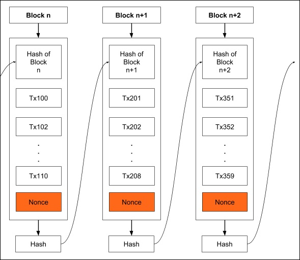

# Block Chain
Notes from the book on [Tutorials Point](https://www.tutorialspoint.com/blockchain/blockchain_introduction.htm).  
Date: 19 August 2020  
**I'm reading this book the secuation where the second time.**  
Mail Here: [vivekascoder@gmail.com](mailto:vivekascoder@gmail.com)

----
## Table of contents.
- [Block Chain](#block-chain)
  - [Table of contents.](#table-of-contents)
  - [1. Introduction](#1-introduction)
  - [2. History](#2-history)
  - [3. Public Key Cryptography](#3-public-key-cryptography)
  - [4. Bitcoin Mining](#4-bitcoin-mining)
  - [5. Proof of work.](#5-proof-of-work)
  - [6. Merkel Tree](#6-merkel-tree)

----

## 1. Introduction
- So far the most optimum implementation is peer2peer cash system.
- **Double Spending**: 
  - In which the sender spend the same money at more than one place for obtaining services or goods from multiple vendors.
  - In real life a person can only give money to another person.
  - But in digital currencies he can give a another digital copy of same money to someone else aka double spending.
  - In order to restrict the *Double Spending**, one can introduce the concept of central authority so that all the transaction can be processed throught that tuthority.
  - But at the same time it requires to give the central authority.
    - Enormous power.
    - Trust of the people.
    - Extra money.
  
## 2. History
- Introduced by **Satoshi Nakamoto** in 2008.
- Bitcoin solved.
  - Double Spending.
  - Anonimity to the people.
  - **Fun Fact**: Satoshi Nakamoto holds a total of about $19.4 billion.
  - Based on PKI i.e public key cryptography.

## 3. Public Key Cryptography
- PKI ensures two things.
  - Authentication.
    - Consider two person Bob and Lisa.
    - Bob's send some money to lisa for purchasing some goods from her. He will send her the encrypted message with the help of Bob's private key and she will decrypt it using Bob's public key that she has.
    - Algorithm involve.
      - RSA.
      - ECDSA.
  - Message Privacy.
  - **Hashing**:
    - Hash maps the data of arbitrary size to the data of fixed size.
    - Bitcoin uses **SHA-256** hash.
    - The size of SHA-256 hash is 256 bits i.e 32 bytes i.e 64 characters long.

## 4. Bitcoin Mining

- Every miner in the network take the incoming messages and combine them in a single block and with a hashing function generate a hash representing that block of messages. 
- Each message is time stamped to restrict the change in it's *chronological order* aka *arrangement of things*.
- **Chaining Blocks**:
  - The blocks from various different miners are chained together to form waht is known as a *truely distributed public ledger*.

  - Each block is the given picture which comes from various miners contains multiple messages.
  - The hash generate in each block is added to the next block.

## 5. Proof of work.
- To each block, we add a new item called **Nonce**.

- **Nonce** is a no. such that hashs meets a certain criterion.
- Nonce means *"No only used once"*.
- This criterion could be that the generated hash should have leading four digits zero.
- A nonce is a random 32 bit i.e 4 byte no. that is added to block in order to generate a valid hash which contains a no. of leading zeros.
- **Golden Ticket**:
  - A golden nonce in Bitcoin is a nonce which results in a ahash value lower than the target difficulty.
  - In many practical mining application, this is simplified to any nonce which has 32 leading zeros.
  
## 6. Merkel Tree
- The 
