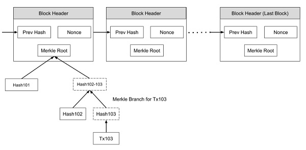

# Painkillers for Blockchain
Notes from the book on [Tutorials Point](https://www.tutorialspoint.com/blockchain/blockchain_introduction.htm).  
Date: 19 August 2020  
**I'm reading this book the secuation where the second time.**  
Mail Here: [vivekascoder@gmail.com](mailto:vivekascoder@gmail.com)

----

## Table of contents.
- [Painkillers for Blockchain](#painkillers-for-blockchain)
  - [Table of contents.](#table-of-contents)
  - [1. Introduction](#1-introduction)
  - [2. History](#2-history)
  - [3. Public Key Cryptography](#3-public-key-cryptography)
  - [4. Bitcoin Mining](#4-bitcoin-mining)
  - [5. Proof of work.](#5-proof-of-work)
  - [6. Merkel Tree](#6-merkel-tree)
  - [7. Payment Verification Process.](#7-payment-verification-process)
  - [8. Resolving Conflicts](#8-resolving-conflicts)
  - [9. Privacy](#9-privacy)
  - [10. Threats of Bitcoin](#10-threats-of-bitcoin)

----

## 1. Introduction
- So far the most optimum implementation is peer2peer cash system.
- **Double Spending**: 
  - In which the sender spend the same money at more than one place for obtaining services or goods from multiple vendors.
  - In real life a person can only give money to another person.
  - But in digital currencies he can give a another digital copy of same money to someone else aka double spending.
  - In order to restrict the *Double Spending**, one can introduce the concept of central authority so that all the transaction can be processed throught that tuthority.
  - But at the same time it requires to give the central authority.
    - Enormous power.
    - Trust of the people.
    - Extra money.
  
## 2. History
- Introduced by **Satoshi Nakamoto** in 2008.
- Bitcoin solved.
  - Double Spending.
  - Anonimity to the people.
  - **Fun Fact**: Satoshi Nakamoto holds a total of about $19.4 billion.
  - Based on PKI i.e public key cryptography.

## 3. Public Key Cryptography
- PKI ensures two things.
  - Authentication.
    - Consider two person Bob and Lisa.
    - Bob's send some money to lisa for purchasing some goods from her. He will send her the encrypted message with the help of Bob's private key and she will decrypt it using Bob's public key that she has.
    - Algorithm involve.
      - RSA.
      - ECDSA.
  - Message Privacy.
  - **Hashing**:
    - Hash maps the data of arbitrary size to the data of fixed size.
    - Bitcoin uses **SHA-256** hash.
    - The size of SHA-256 hash is 256 bits i.e 32 bytes i.e 64 characters long.

## 4. Bitcoin Mining

- Every miner in the network take the incoming messages and combine them in a single block and with a hashing function generate a hash representing that block of messages. 
- Each message is time stamped to restrict the change in it's *chronological order* aka *arrangement of things*.
- **Chaining Blocks**:
  - The blocks from various different miners are chained together to form waht is known as a *truely distributed public ledger*.

  - Each block is the given picture which comes from various miners contains multiple messages.
  - The hash generate in each block is added to the next block.

## 5. Proof of work.
- To each block, we add a new item called **Nonce**.

- **Nonce** is a no. such that hashs meets a certain criterion.
- Nonce means *"No only used once"*.
- This criterion could be that the generated hash should have leading four digits zero.
- A nonce is a random 32 bit i.e 4 byte no. that is added to block in order to generate a valid hash which contains a no. of leading zeros.
- **Golden Ticket**:
  - A golden nonce in Bitcoin is a nonce which results in a ahash value lower than the target difficulty.
  - In many practical mining application, this is simplified to any nonce which has 32 leading zeros.
  
## 6. Merkel Tree

- The issue of disk space can be easily fixed with the help of *Merkel Tree*.
- The *Block Header* contains:
  - Hash of previous block.
  - Nonce.
  - Root Hash: A hash for all the transaction in the *Merkel Tree*.
  - Since instead of all transaction we use a hash. This is how we save disk space.
  - **This strategy is only for the client who just want his transaction to complete but in case of the miners, they need to save the whole disk space.**

## 7. Payment Verification Process.
- The miner who want to verify the payment can start searching backwards untill they find the desired timestamped transaction. Now, they can request the merkel tree of selected block to get the information about your transaction.

- **You can't see the content of that transaction.**

## 8. Resolving Conflicts
- The conflict here is that
  - Suppose in a bitcoin network two d/f miners solve the same Proof-of-Work at the same time thus adding two blocks to the the last block in the blockchain.

- Now, the next mined block can be added to any branch, let say that it's now added to block 104A.

- So the branch 104A is longer than 104B.
- In blockchain architecture the longest branch is taken under consideration and the rest one will be returned to the transaction pool.= from where it can be added to a new branch.

## 9. Privacy
- Problem:
  - In blockchain system the bitcoin transaction is made truly publical, so now the privacy is at stake.
- This problem can be solved with the anonimity of the public key of a person, the person's public key is the way to send him money.
- Anyone outside the transacto=ion only knows how much money is send to which public key.
- In order to get the highest degree of privacy one can generate d/f public key for different transaction this way it will be quite difficult to point out to whon the money is sent.

## 10. Threats of Bitcoin
- Race Attack:
  - In this type of attack, the attacker needs to send the same coin at different place within rapid succession, so that if the vendor do not wait for the block sonfirmation he will soon realize that the transaction was rejected.
  - **How to fix:**
    - The vendor needs to wait untill the confirmation of atleast one block.
- Finney Attack: 
  - In this attack the attacker is the miner.
  - The miner mines a block with his transaction but do not release it into system the he  again uses the same coin in the second transaction and then releases the pre mined transaction into the system although the second transaction will be rejected but it will take some time.
  - **How to fix:**
    - The seller sould wait for at least 6 block confirmation.
- The 51% Attack: 
  - Consider a hypothetical scenerio, where a person has enormous computation power and with this power athe attacker can double spend his coing in his private bllockchain, since his blockchain is longer than the honest network, he then releases his private blockchain in his system where the honest blockchain will be rejected.
  - As he owns the majority of coputing power, this is gauranteed that at some point of time his blockchain will be the longest one.
  
